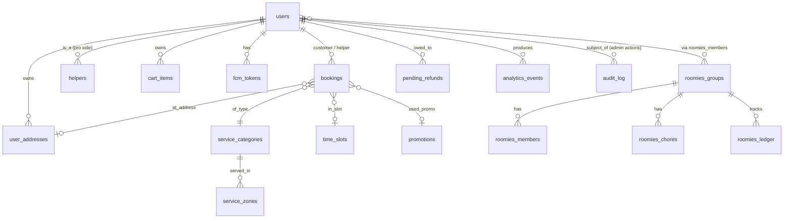

# ZopMop — Business + Operations Manual

> **Audience**: founders, investors, ops leads, new hires.
> **Goal**: explain how ZopMop actually works, end-to-end, without reading source code.
> **Scope**: marketplace mechanics, customer + pro journeys, backend internals (especially **how a pro gets assigned to a booking**), payments, security, and what breaks under load.

---

## 1. Elevator pitch

ZopMop is a mobile marketplace for on-demand household help — cooks, cleaners, babysitters, etc. **Customers** pay through the ZopMop app to book a vetted **pro** ("helper") who shows up at their address; **pros** earn per job. We win by combining instant matching (a pro within minutes), batch optimisation (so the best pro doesn't get greedy-grabbed by the first request in a hot zone), and a Roomies feature that lets shared-living households split bills automatically.

---

## 2. Marketplace overview

**Two-sided marketplace.**

- **Customers** open the app, pick a service, pick an address + slot, tap *Confirm Booking*. They are billed (currently pay-on-completion; Cashfree PG is being wired backend-first, with the RN checkout sheet to follow).
- **Pros / helpers** sign in to the same app via the *Pro* tab, go online, accept invites the matching engine sends them, complete the job, and earn.

**Service categories** are stored in the `service_categories` table and seeded by migrations 015 + 017. Examples: Cooking, Cleaning, Babysitting. Each category has:

- a `base_price_cents` (the headline fee for the standard duration),
- a `min_duration_minutes` (the smallest bookable window),
- per-minute add-on options.

**Pricing model**: `total = base_price_cents + platform fee + (optional surge multiplier) − promo discount`. The platform fee + surge are read at booking time from the `app_config` table via `config_manager.GetPricingConfig`. Defaults if config is missing: `BaseFeeCents = 2000` (₹20), `SurgeMultiplier = 1.0`. *To confirm with product: per-minute add-on pricing is implemented in `cart` but the headline service price today is flat per category.*

**City footprint**: defined by polygons in `service_zones` (PostGIS). The mobile app calls `GET /zones/check` with `lat,lng` on first open and shows the *NotServiceable* screen if the point falls outside any zone. Currently a single zone (Gurugram) is seeded; new cities = new rows.

**Roomies add-on** (`internal/roomies/`): a customer can create a roommate group, members top up a *prepaid balance* into a shared *vault*, and group chores are auto-split with member-level debt tracking. Closes the "who paid for the cleaner this week?" problem.

---

## 3. Customer journey (step-by-step)

Each step lists the **screen** and the **backend endpoint** it hits.

| # | Step | Screen | Backend |
|---|---|---|---|
| 1 | First open / phone OTP | `PhoneEntryScreen` → `OTPVerificationScreen` | `POST /auth/otp/send`, `POST /auth/otp/verify` (or `POST /auth/firebase` for Firebase-issued OTP) |
| 2 | JWT issued + stored in Keychain/Keystore | — | server returns 24h HS256 JWT (current default) |
| 3 | Home — nearby pros pill, hero carousel, popular services | `HomeScreen` | `GET /insights/nearby?lat=…&lon=…`, `GET /services` |
| 4 | Browse all services | `AllServicesScreen` | `GET /services` |
| 5 | View service detail + pick duration | `ServiceAboutScreen` | `GET /services/:id` |
| 6 | Add to cart | `ServiceAboutScreen` → `CartScreen` | `POST /cart/items` |
| 7 | Pick address | `AddressesScreen` | `GET /addresses`, `POST /addresses` |
| 8 | Pick slot (date + time) | inside Cart | `GET /slots?date=…` |
| 9 | Tap *Confirm Booking* | `CartScreen` | `POST /bookings/scheduled` (with `Idempotency-Key`) |
| 10 | Booking confirmation | `BookingConfirmedScreen` | — |
| 11 | Wait for pro (instant only) | `InstantMatchingScreen` | polls `GET /bookings/:id` for status; 30-second window |
| 12 | Live tracking once accepted | `ActiveBookingScreen` | `GET /bookings/:id`, WebSocket `wss://…/location/helper/:id` |
| 13 | Service complete | `ActiveBookingScreen` (state changes to *Service Complete*) | helper hits `POST /bookings/:id/complete` |
| 14 | Payment | (today: pay-on-completion in cash; Cashfree PG hosted checkout in flight backend-side) | `PaymentScreen` will be replaced with the Cashfree React Native SDK (`doWebPayment`) |

**Instant vs scheduled**: the difference is the `time_slot_id`. Instant bookings hit `POST /bookings` and are enqueued into the matching batcher immediately. Scheduled bookings hit `POST /bookings/scheduled`, get a slot row, and are matched by a separate pre-dispatch job near the slot start time. *To confirm: pre-dispatch worker for scheduled bookings is referenced in code comments but not yet a separate worker — currently the same engine handles them on demand.*

---

## 4. Pro / helper journey

| # | Step | Screen | Backend |
|---|---|---|---|
| 1 | Phone OTP login (same as customer) | auth flow | `POST /auth/otp/verify` |
| 2 | Apply to be a pro | `OnboardProScreen` | `POST /me/onboard-pro` — inserts `helpers` row with `approval_status='pending'`, **does not change `users.role`** |
| 3 | Wait for admin approval | — | admin flips `approval_status='approved'`; until then the helper sees a "pending" gate |
| 4 | Go online | `ProDashboardScreen` toggle | `PUT /helpers/me/status` (sets `is_available=true`); a `setInterval` pushes location every 2 min via `PUT /helpers/me/location` |
| 5 | Receive invite | push notification + `ProDashboard` poll | `GET /helpers/me/invites` (Redis-backed) |
| 6 | Tap *Accept* | `ProMatchedScreen` | `POST /bookings/:id/accept` — first acceptor wins via DB row-lock |
| 7 | On the way / arrived / in progress | `ProActiveScreen` | `PATCH /bookings/:id/status` + WebSocket location push every 10 s |
| 8 | Mark complete | `ProActiveScreen` | `POST /bookings/:id/complete` |
| 9 | Earnings + Roomies vault payouts | `ProDashboard`, `ProEarnings` | (earnings dashboard is read-only; payout pipeline not yet built) |

**Approval gate** is enforced at the database row level (`approval_status` column added in migration 033). Helper routes still trust the JWT `role` claim today — the recommended follow-up is to add a route-level check that reads `approval_status` per request, or to issue a fresh JWT once approval flips.

---

## 5. Backend — how each part works

The backend is one Go binary (`cmd/api`) running Fiber v2, talking to Postgres (with PostGIS) and Redis. All requests pass through global middleware: request-ID, security headers, CORS, CSRF (skipped for Bearer auth), request logger, and a per-IP rate limiter.

### 5.1 Auth (OTP + Firebase)

- **OTP path** (`internal/auth/service.go`): client sends phone → server SetNX-locks a 60-second cooldown → generates a 6-digit OTP → stores in Redis at `otp:<phone>` with 10-minute TTL → SMS gateway delivers (in dev, the OTP is echoed in the response). Verify: 5 wrong attempts within the OTP lifetime locks the phone for 15 minutes.
- **Firebase path**: client uses Firebase Auth (Google's OTP infra), then sends the resulting ID token to `POST /auth/firebase`. Server validates the token via Firebase Admin SDK and extracts the verified phone. Useful in places where SMS deliverability is poor.
- **JWT**: 24-hour HS256 with `kid` header for key rotation. No refresh-token flow yet (see Roadmap).
- **Suspension**: `is_suspended` is a column on `users` and a claim on the JWT. Admin flipping the column today only takes effect on the user's next OTP cycle (24h gap is the documented audit gap; revocation list is on the roadmap).

### 5.2 Booking lifecycle

States (from migration 004): `pending → accepted → in_progress → completed | cancelled`.

Transitions:

```
pending ── customer cancels ──> cancelled
pending ── helper accepts ─────> accepted ── helper marks on-the-way/arrived ──> in_progress ──> completed
accepted ── customer cancels (within 5 min free window) ─> cancelled
```

The cancellation window is read from `app_config` (default 5 min free, then a fee — fee charging is TODO). The booking row stores `cancelled_by` so we know who pulled the plug.

**Idempotency**: `POST /bookings` and `POST /bookings/scheduled` are wrapped in a Redis-backed idempotency middleware. Clients send `Idempotency-Key: <uuid>`; the server caches the 2xx response under `idem:<userID>:<key>` for 10 minutes. Retries (network drops, app backgrounded mid-tap) get the cached response back instead of creating a duplicate booking.

### 5.3 Matching engine — see Section 6 for the deep dive

### 5.4 Location service

- **Pro app → Server**: a WebSocket at `wss://…/location/ws` with auth-on-first-message (no token in URL — keeps phone GPS coords out of access logs). The pro app sends `{lat, lng}` every 10 seconds while a booking is active.
- **Server → Redis**: every ping writes to two keys: a TTL marker `helper:active:<helperID>` (5-min TTL — used by matching engine to drop stale helpers) and the geo index `helpers:locations`.
- **Customer app → Server**: `GET /location/helper/:id` (with IDOR check: caller must be admin, the helper themselves, or have an active booking with that helper). Returns latest lat/lng.
- **What breaks**: if Redis dies, location reads fail-soft (matching falls back to Postgres haversine; live tracking goes blank but the booking continues).

### 5.5 Cart + pricing

Cart rows live in Postgres (`cart_items` per user). Add-on toggles change the per-minute calc. On checkout the cart is converted to one or more `BookingServiceItem`s. **Promo codes** are validated by `repo.ValidatePromoCode` (checks `is_active`, `expires_at`, `max_uses`); on successful booking, `IncrementPromoCodeUsage` runs `UPDATE … SET uses=uses+1 WHERE id=$1 AND uses < max_uses` — atomic via row-level lock.

### 5.6 Roomies

Three core concepts:

- **Group**: a roommate household (table `roomies_groups`).
- **Vault**: per-group shared balance — sum of all members' prepaid contributions.
- **Prepaid balance**: each member's portion of the vault.

A *group chore* (e.g., a shared cleaning) is paid from the vault and split across selected members. If a member's share exceeds their prepaid balance, the shortfall becomes a tracked debt. `internal/roomies/cron.go` runs an `AutoSettleCron` that nets debts within the group on a schedule.

**Force-delete** (a host blowing up the group): we now insert a `pending_refunds` row per member with non-zero balance *before* the destructive delete. A future settlement worker will sweep `pending_refunds` and credit a main wallet (wallet itself is on the roadmap).

### 5.7 Notifications (FCM)

`internal/notification/service.go` resolves a userID → list of FCM tokens (multiple devices per user) → calls Firebase. Triggered when:

- a booking is created (notify candidate helpers — fans out to top-K invites),
- a helper accepts (notify customer),
- a booking is cancelled (notify the assigned helper),
- a re-engagement reminder fires (dormant customer reminder).

Admin "broadcast" path exists (`POST /admin/notifications/broadcast`) — gated by `PermManageUsers`. *Should be split into a dedicated `PermBroadcast` once we run a real marketing channel.*

### 5.8 Analytics

- **Client events**: app posts `{event_name, properties}` to `POST /api/v1/events`. Properties are sanitised — keys like `token`, `password`, `otp`, `aadhaar`, `card`, etc. are dropped before persistence; values that look like card numbers are regex-redacted.
- **Server events**: `analytics.Track(...)` is called fire-and-forget from booking, cart, helper services for things like `EventBookingCreated`, `EventBookingCancelled`.
- **Rollups**: `RollupWorker` runs every minute, summarises raw events into `analytics_rollups_hourly` for the admin dashboard.

### 5.9 Admin tools

Permission model: each admin user has a JSON column `permissions` containing keys like `manage_users`, `manage_services`, `manage_config`, `view_analytics`. Routes are gated by `RequirePermission(PermXxx)`. Cache: per-admin permission set is cached in Redis 5 min — invalidate on permission change.

Admin pages in scope: users (suspend, view bookings), services (create/edit/delete categories), zones (define service polygons), promotions, banners, content, analytics dashboard, runtime metrics (`/admin/runtime/metrics`: DB pool stats, rate-limiter metrics, rollup worker stats).

Every state-changing admin action should write a row to `audit_log` (admin_id, action, target, before/after JSON, timestamp). *Gap: broadcast doesn't audit-log today; flagged in the audit.*

### 5.10 Insights / re-engagement

- **Insights** (`/insights/nearby`): public, unauthenticated. Drives the home pill ("3 pros nearby · ~12 min ETA"). Reads Redis geo + a small Postgres aggregate. **Fail-soft**: if Redis blips, returns zeros instead of 500ing the home screen.
- **Re-engagement worker**: scans for users who completed a booking 30+ days ago and haven't returned, sends a push reminder. Frequency: every 5 minutes the worker wakes up and checks the next batch.

---

## 6. Worker (pro) assignment — deep dive

This is the heart of the marketplace. Walking through one **instant booking** end-to-end:

### Step 0 — Customer hits *Confirm Booking*

App calls `POST /bookings` with `service_category_id`, `address`, `lat`, `lng`. Server:

1. checks customer's active bookings doesn't exceed `max_active_per_customer` (default 1),
2. validates the service category exists + is active,
3. computes price (base + platform fee + surge − promo),
4. **inserts the booking row** with `status='pending'`,
5. atomically increments promo code usage if applicable,
6. calls `matching.TrackDemand` which `INCRBY`s a Redis ZSET keyed by H3 hex cell + 15-min bucket — drives the surge heatmap,
7. **enqueues** a `BatchEntry{BookingID, CustomerID, Lat, Lng, CellID, EnqueuedAt}` into the matching batcher's in-memory channel (buffer 512).

If the buffer is full, the entry drops but the Postgres row is still `pending`, and the batcher's next tick will pick it up via `FetchPendingUnmatched` (the safety net).

### Step 1 — The batch tick (every 5 seconds)

Why batch instead of match-on-write? If ten customers in the same neighbourhood book within a 5-second window, processing them one-by-one greedily assigns the best pro to whoever-was-first. Batch matching solves all ten together, minimising **total** wait across the batch — the textbook ride-share insight.

The batcher (`internal/matching/batch.go:77`) does this loop:

1. drain the channel into a slice,
2. also `SELECT … FROM bookings WHERE status='pending' AND match_attempts < N` so retries + server-restart leftovers get picked up,
3. for each booking, run `fetchAndScoreCandidates` → `filterByWalkingTime` → store the candidate list per booking,
4. run `GreedyAssign` — globally — to map each booking to up to `MaxHelpersNotified` (default 3) candidate helpers, ensuring no single helper is invited to multiple bookings in the same window,
5. write results to Redis, increment `match_attempts` in Postgres.

### Step 2 — How `fetchAndScoreCandidates` builds the pool

For one `(lat, lng)`:

#### a) Geo candidate set

`Redis GEOSEARCH` on the `helpers:locations` ZSET, radius = `RadiusKm` (default 5 km, configurable). Fetch up to `MaxHelpersNotified × 4` (or 20, whichever is bigger). If GEOSEARCH errors (Redis blip), fall back to Postgres haversine over the `helpers` table.

#### b) Postgres enrich + filter

Single SQL:

```sql
SELECT h.id, COALESCE(h.rating,5), COALESCE(h.total_jobs,0),
       COALESCE(active.cnt,0)
FROM helpers h
LEFT JOIN (SELECT helper_id, COUNT(*) AS cnt FROM bookings
           WHERE status IN ('accepted','in_progress')
           GROUP BY helper_id) active ON active.helper_id = h.id
WHERE h.id = ANY($1::uuid[])
  AND h.is_available = true
  AND COALESCE(h.rating,5) >= $2
```

`$2` = min rating (default 3.0). Drops offline pros and low-rated pros in one shot.

#### c) Stale-location check

For each surviving candidate, check `EXISTS helper:active:<id>` in Redis. If the TTL marker has expired (> 5 minutes since last GPS ping), drop them — we don't want to dispatch to someone who closed the app.

#### d) Walking-time filter (optional)

If a Google Maps client is configured, `filterByWalkingTime` calls Google Distance Matrix in parallel goroutines (each capped 5s) for each candidate; helpers whose walk time exceeds `MaxWalkMinutes` are dropped. If Google Maps is misconfigured or quota-exhausted, the filter is skipped (log warning) and we fall back to straight-line distance.

#### e) Scoring

`ScoreCandidate` (`internal/matching/score.go`) computes a `[0, 1]` score:

| Component | Weight | Formula |
|---|---|---|
| Proximity | 35% | `e^(-distance_km / 5)` — exponential decay; 1 km ≈ 0.82, 5 km ≈ 0.37 |
| Rating | 35% | `(rating − 1) / 4` — linear `[1,5] → [0,1]` |
| Experience | 20% | `log(1 + jobs) / log(1 + 100)` — log-scale, caps at 100 jobs |
| Availability | 10% | `1 / sqrt(1 + active_bookings)` — penalises busy pros |

Quality and reliability dominate over raw distance because we're a scheduled-services marketplace, not a ride-hail. A 5-star helper 3 km away beats a 3.5-star helper 500 m away.

#### f) Top-K become invites

`storeMatchResults` writes:

- `match:b:<bookingID>` → JSON of top-K helpers (TTL = `TimeoutSeconds`, default 30 s),
- `match:h:<helperID>` → SET membership of `bookingID` (same TTL).

Each invited helper sees the booking on their `ProDashboard` invite list (polled + push-notified).

### Step 3 — Pro accepts

Helper taps Accept → app calls `POST /bookings/:id/accept`. Server:

1. fetches the booking; rejects if `status != pending`,
2. checks helper's own active-booking cap (default 3),
3. runs `UPDATE bookings SET helper_id=$1, status='accepted' WHERE id=$2 AND status='pending'` — **the row condition is the CAS**: only one helper wins, all others get 0 rows updated and a `booking already accepted` error,
4. fires off `ClearMatchOnAccept` (deletes the booking match key + removes the booking ID from all other invited helpers' invite sets) — losers are notified via the next poll/push,
5. notifies the customer.

### Step 4 — Timeout (no acceptance within 30 seconds)

Currently the customer's `InstantMatchingScreen` shows a 30-second progress bar (`MATCH_DURATION = 30000` after the recent fix). At 30 s with no accept, the screen flips to a "All pros busy" state. The customer can tap *Try Again* to re-submit. *Future*: server-side auto-expand-radius retry — the engine already has a two-phase search (`RadiusKm` then `MaxRadiusKm`), but it isn't yet wired to the timeout retry loop.

### Step 5 — Tunable knobs

All in `app_config` (read by `config_manager`):

- `matching_radius_km` — initial search radius (default 5)
- `matching_max_radius_km` — phase-2 expand radius (default 10)
- `matching_max_helpers_notified` — invite fan-out (default 3)
- `matching_timeout_seconds` — invite TTL (default 30)
- `helper_min_rating_to_appear` — quality floor (default 3.0)
- `booking_max_active_per_customer` (default 1), `booking_max_active_per_helper` (default 3)
- `booking_cancellation_window_minutes` (default 5)
- pricing: `pricing_base_fee_cents`, `pricing_surge_multiplier`, `pricing_surge_enabled`

Ops can change these from the admin panel without a deploy.

---

## 7. Ordering + payments

**Today**:

- *Confirm Booking* creates a booking row + a price snapshot. **No money moves.** Payment is collected on completion (cash or the legacy app-side `PaymentScreen`, which is being replaced).
- The CartScreen previously labelled the CTA "Pay Now" + showed a fake `Alert.alert('Booking Confirmed!')`. That was misleading; the recent UX fix renamed the CTA to *Confirm Booking* and replaced the alert with a real `BookingConfirmedScreen`.

**Target state (in flight, Phases 2-6 of payments rewrite)**:

- Single-gateway architecture on Cashfree: **Cashfree PG** (`api.cashfree.com/pg`) for collection (orders, hosted checkout, webhooks, refunds) and **Cashfree Payouts** (`payout-api.cashfree.com`) for helper disbursement (already wired for `/payments/validate-vpa`).
- Confirm-Booking flow will create a Cashfree order via `POST /payments/cashfree/order`, return a `payment_session_id` to the RN app, the app drives the Cashfree React Native SDK (`doWebPayment`) for the hosted checkout, and the gateway notifies us at `POST /payments/cashfree/webhook`. Server-side webhook handler is the source of truth; the RN app polls `GET /payments/cashfree/orders/:orderID/status` for up to 60s after the sheet closes.
- A **closed-loop wallet** (`wallets` + `wallet_transactions` — see migration 067) will hold Cashfree-funded credits spendable only on Zopmop bookings — no P2P, no withdrawal — keeping the product outside RBI PPI licensing.
- Roomies vault top-ups land in the same wallet via Cashfree PG; refund queue (`pending_refunds`) settles on group force-delete or member exit, optionally crediting the wallet instead of the original card.

**Idempotency on retry**: as covered above — `Idempotency-Key` header on `POST /bookings*` makes retries safe.

---

## 8. Data model (high level)



**Spine in plain English**:
- `users` is the universal identity (customer, pro/helper, admin all share this table — distinguished by `role`).
- `bookings` is the central transaction record.
- `helpers` extends `users` with pro-specific fields (rating, total_jobs, current_lat/lng, is_available, approval_status).
- `service_categories` + `service_zones` define what we sell + where.
- `roomies_*` is a self-contained subgraph for the household-share feature.
- `analytics_events` + `analytics_rollups_hourly` for product analytics.
- `audit_log` for compliance + admin accountability.

---

## 9. Infrastructure + reliability

**Runtime**:

- **Postgres + PostGIS** — source of truth for everything. PostGIS for service-zone polygons and haversine fallback when Redis is down.
- **Redis** — hot-path cache for OTPs, rate limits, helper geo index, match results, idempotency, demand counters, admin permission cache.
- **Stateless Go API** — single binary (`cmd/api`), behind any LB. Horizontal scaling by adding replicas.
- **Background workers** running in-process: matching `Batcher` (5 s tick), analytics `RollupWorker` (1 min), `ReengagementWorker` (5 min), Roomies `AutoSettleCron`. Each worker has a clean stop signal and the matching/analytics ones are wrapped in `SafeGo` panic recovery.

**Probes**:

- `GET /health` — liveness, returns `{"status":"ok"}` unconditionally.
- `GET /ready` — readiness, pings both Postgres + Redis with a 1 s timeout. **Use `/ready` for k8s readinessProbe**, `/health` for livenessProbe.

**Graceful shutdown**: SIGTERM → Fiber stops accepting new requests, drains in-flight (10 s timeout) → workers stop on `defer` (matching batcher, rollup, re-engagement) → DB pool + Redis close.

**Observability gaps** (currently no Sentry / Crashlytics / Prometheus):

- request-IDs are set on responses + injected into the request logger; per-handler error logs don't all carry the request_id yet (in progress).
- mobile client now generates `X-Request-ID` per request (recent fix), so client→server correlation is possible if logs surface it.
- planned: wire Sentry SDK in the RN entry + Fiber `ErrorHandler`; expose `/metrics` (promhttp) on a private port.

---

## 10. Security guardrails

**Role separation**: `users.role ∈ {customer, helper, admin}`. JWT carries the role; middleware (`RequireRole`) gates customer-only and helper-only routes; `RequirePermission` is layered on top of `AdminMiddleware` for fine-grained admin access.

**Privilege upgrades**: `OnboardPro` no longer flips `users.role` on demand. It writes a `helpers` row with `approval_status='pending'`. An admin must approve before the pro can receive invites.

**JWT lifecycle**: 24h HS256 today. Target: 15-minute access + 24h rotating refresh. Revocation via Redis blacklist of `jti`s — on roadmap.

**OTP rate limiting**:

- Per-IP: 20 / minute on `/auth/*` (Redis-backed `SensitivePublicRateLimit`).
- Per-phone: 60 s send cooldown, 5 wrong-attempt lock for 15 min.
- *Gap*: no per-phone daily SMS cap → toll-fraud (1 OTP/min × 1440 = 1440 SMS/day per phone). Cap is on the next-sprint list.

**PII handling**:

- Phone numbers in logs are masked to `***1234` via `logger.MaskPhone` (recent fix).
- Lat/lng in logs are rounded to 2 decimals (~1.1 km).
- *Future*: column-level encryption (`pgcrypto`) for `users.phone`, `user_addresses.full_address`, `user_addresses.receiver_phone` for GDPR/DPDP compliance.

**IDOR mitigations recently shipped** (see `docs/AUDIT.md`):

- `GET /location/helper/:id` now requires admin / self / active booking.
- `POST /bookings/scheduled` verifies caller owns the `address_id`.
- `DELETE /addresses/:id` verifies ownership before nullifying any booking references.
- `GET /roomies/groups/:id/ledger` and `/vault` require group membership.
- `BookGroupChore` checks initiator membership before any DB write.
- Admin services + zones routes require explicit `PermManageServices` / `PermManageConfig`.

**Idempotency + recover**: `POST /bookings*` retries are deduped; fire-and-forget goroutines in booking + matching are wrapped in `SafeGo` so a single panic in one of them doesn't crash the API process.

---

## 11. Unit-economics hooks (where the levers live)

| Lever | Where | Default |
|---|---|---|
| Platform fee | `app_config.pricing_base_fee_cents` | 2000 (₹20) |
| Surge multiplier | `app_config.pricing_surge_multiplier`, `pricing_surge_enabled` | 1.0, off |
| Service base price | `service_categories.base_price_cents` (per-row) | varies |
| Match radius / max-radius | `app_config.matching_radius_km`, `matching_max_radius_km` | 5, 10 |
| Min helper rating | `app_config.helper_min_rating_to_appear` | 3.0 |
| Active-booking caps | `app_config.booking_max_active_per_customer`, `…_per_helper` | 1, 3 |
| Cancellation window | `app_config.booking_cancellation_window_minutes` | 5 |
| Promo code limits | per-row in `promotions` (`max_uses`, `expires_at`, `discount_type`, `discount_value`) | per promo |
| Roomies fee | not yet productised — Roomies vault is currently free; fee row TBD |
| OTP cooldown | hardcoded const `otpSendCooldown` | 60 s |

Most of the above is changeable via the admin panel — no deploy needed.

---

## 12. Risk + what breaks under load

- **Match latency vs Google Maps quota**: `filterByWalkingTime` calls Distance Matrix in parallel; under burst load we'll hit Google's per-second cap. Engine falls back to skipping the filter (log warn). Cache hits help — `googlemaps.Client` caches results in Redis, so the same origin/destination pair is free until TTL.
- **Redis pool size = 10 (default)**: at scale, contention will stall booking creation, location WS, rate limiter, and idempotency middleware. Tune `redis.Options.PoolSize` upward in production envs.
- **Goroutine recover wrappers + idempotency caps** mostly mitigate retry storms — but **no global retry budget** today. A misbehaving client can still flood `POST /bookings` up to its per-user limit (100/min today; should be 5/min for booking creation specifically).
- **SMS toll-fraud**: per-phone send cooldown is 60 s. No daily cap. A patient attacker can drain 1440 SMS/day per phone they control.
- **WebSocket fan-out**: location WS holds one connection per active pro. With no idle timeout post-auth (recent gap), connected pros that stop sending heartbeats will hold sockets indefinitely. SetReadDeadline pacing is on the list.
- **Matching batcher buffer = 512**: if instant bookings burst beyond that in 5 s, entries drop and rely on the DB-scan fallback. Acceptable degradation; alarm on it.

---

## 13. Roadmap hooks (what code already hints at)

- **Wallet for Roomies refunds** — `pending_refunds` table is wired; we still need the settlement worker that reads from it and credits a `users.wallet_balance_cents`.
- **Payment sheet wiring** — Cashfree PG backend (orders, webhooks, refunds) is being wired; `PaymentScreen.tsx` will be replaced by the Cashfree React Native SDK in a follow-up.
- **Prod telemetry stack** — Sentry SDK wiring, `/metrics` Prometheus endpoint, OpenTelemetry tracing.
- **KYC flow upgrade** — `helpers.approval_status` exists; admin-side approval UI + ID-doc upload pipeline are next.
- **Refresh tokens + JWT revocation list** — short access + rotating refresh.
- **Per-phone daily SMS cap** — close the toll-fraud window.
- **Pre-dispatch worker for scheduled bookings** — currently the same engine handles both flows; a dedicated worker keyed off `time_slots.start_at - 30 min` would let scheduled bookings warm-up matching well before the slot starts.
- **Cancellation fee charging** — TODO comment in `booking/service.go:227`.

---

## 14. Glossary

| Term | Plain English |
|---|---|
| **Pro / helper** | Someone who delivers a service. Stored as a `users` row with `role='pro'` plus a `helpers` row holding rating, total_jobs, location, availability. |
| **Customer** | Someone who books a service. `users` row with `role='customer'`. |
| **Admin** | Internal user with permissions to manage users/services/config. `users` row with `role='admin'` + a JSON `permissions` set. |
| **Instant booking** | Customer wants a pro now. Backend matches within ~30 seconds. |
| **Scheduled booking** | Customer picks a future time slot. Backend matches closer to slot start. |
| **Invite** | A pending booking offered to a helper. Stored in Redis at `match:h:<helperID>` with a 30 s TTL. |
| **Batch tick** | The matching engine runs every 5 seconds, processing all newly-enqueued instant bookings together (Uber-style batch matching). |
| **Roomies vault** | The pooled balance for a roommate group, summed from each member's `prepaid_balance`. |
| **Prepaid balance** | One member's portion of the vault. Topped up via Cashfree PG into the closed-loop wallet; spent on group chores; shortfalls become tracked debts. |
| **Idempotency key** | A UUID the client sends with `POST /bookings*` so retries don't create duplicates. |
| **Supply cell** | An H3 hex bucket. We track helper count per cell to compute the demand/supply ratio for surge. |
| **Demand bucket** | A 15-minute window keyed by `(cell, time_bucket)`. We `INCRBY` on every booking attempt to drive the surge heatmap. |
| **Approval status** | `helpers.approval_status ∈ {pending, approved, rejected}`. Until approved, a pro can't actually receive invites. |
| **Pending refund** | Row in `pending_refunds` queueing a wallet credit owed to a member after Roomies group force-delete. Settled by a future worker. |
| **CSRF skip on Bearer** | The mobile app sends a Bearer JWT, not a cookie, so CSRF protection is bypassed for those requests (CSRF is only relevant to cookie-auth web clients). |
| **SafeGo** | Helper that wraps `go func()` calls with `recover()` so a panic in a fire-and-forget goroutine logs + dies instead of crashing the whole API. |

---

*Last updated 2026-05-01. Cross-reference `docs/AUDIT.md` for security invariants and ongoing follow-ups.*
