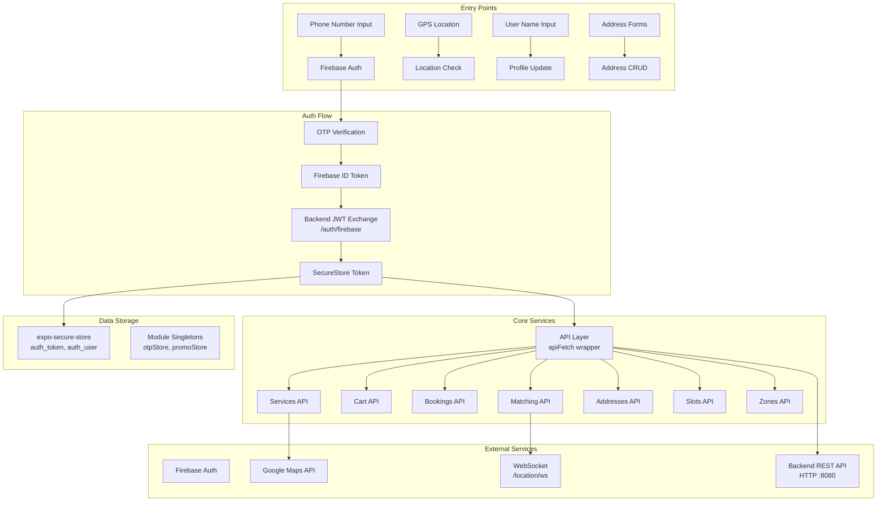

# 🔒 ZopMop Mobile App — Security Audit Report

**Audit Date:** 2026-04-06  
**Auditor Role:** Principal Security Engineer  
**Scope:** `App/zopmop-app/` — React Native (Expo SDK 54) mobile application  
**Mode:** Read-Only (no code modifications)  
**Confidence Methodology:** High = direct evidence in code; Medium = inferred from patterns; Low = theoretical/environmental

---

## Executive Summary

The ZopMop mobile application is a home-services marketplace built with React Native (Expo), Firebase Auth, and a Go backend. The audit uncovered **28 findings**: **5 Critical**, **7 High**, **10 Medium**, and **6 Low** severity issues.

The most urgent issues are:
1. **Google Maps API key hardcoded in version-controlled `app.json`** — extractable by anyone with repo access or APK/IPA decompilation.
2. **All API traffic routed over plaintext HTTP** with no TLS enforcement or certificate pinning.
3. **Firebase Phone Auth verification disabled in development** via `__DEV__` flag — if a dev build leaks to production, OTP bypasses are trivial.
4. **JWT tokens passed as WebSocket query parameters** — logged by proxies and browser history.
5. **Fail-open serviceability check** — network errors default to `serviceable: true`, bypassing geo-restrictions entirely.

The application has solid architectural fundamentals (SecureStore for tokens, proper 401 auto-sign-out, Firebase-backed auth), but suffers from credential exposure, missing transport security, absent input validation, and several code quality gaps that would compound risk in production.

---

## Application Architecture Overview



### Key Data Flows

| Flow | Path | Sensitive Data |
|------|------|---------------|
| **Authentication** | Phone → Firebase → ID Token → Backend → JWT | Phone number, Firebase token, JWT |
| **Location** | GPS → Backend (`/helpers/me/location`) | Precise GPS coordinates |
| **Booking** | Cart → `/bookings` → Match → Track | Address, lat/lng, booking details |
| **Token Storage** | JWT → `expo-secure-store` | Authentication credential |
| **WebSocket** | Token in URL query → `/location/ws` | JWT, real-time GPS |

---

## Attack Surface Analysis

| Surface | Entry Point | Risk Level |
|---------|-------------|------------|
| Network API calls | All `fetch()` / `apiFetch()` calls | **Critical** — HTTP only |
| WebSocket | `getLocationWsUrl()` — token in query string | **Critical** |
| `.env` variables | `EXPO_PUBLIC_*` prefix → bundled in JS | **High** |
| `app.json` | Hardcoded Google Maps API key | **Critical** |
| Firebase config | `GoogleService-Info.plist` on disk | **Medium** |
| Navigation params | `backendToken` passed between screens | **High** |
| User inputs | Phone, name, address fields | **Medium** |
| Deep links / URL schemes | `CFBundleURLSchemes` in `app.json` | **Low** |

---

## Detailed Vulnerability Findings

---

### Finding 1: Google Maps API Key Hardcoded in `app.json`

| Field | Value |
|-------|-------|
| **Severity** | 🔴 Critical |
| **Category** | API Security / Credential Exposure |
| **Location** | [app.json](file:///Users/adityarohilla/Documents/ZopMop/App/zopmop-app/app.json#L44) |
| **Confidence** | High |

**Description:**  
The Google Maps API key `AIzaSy...REDACTED` is hardcoded directly in `app.json` at line 44 under the Android config. This file is version-controlled and committed to the repository.

**Evidence:**
```json
"config": {
  "googleMaps": {
    "apiKey": "AIzaSy...REDACTED"
  }
}
```

**Attack Vector:**  
1. Any developer or collaborator with repo access can extract the key.
2. The key is embedded in the compiled Android binary and can be extracted via APK decompilation (`apktool`, `jadx`).
3. Attackers can use the key for geocoding, directions, and places API calls — billing your Google Cloud account.

**Impact:**  
- **Financial:** Unlimited API consumption charged to your GCP billing account. A targeted abuse campaign could generate thousands of dollars in charges within hours.
- **Service disruption:** Google may throttle or suspend the key, breaking Maps functionality for all users.

---

### Finding 2: Google Maps API Key Exposed via `EXPO_PUBLIC_` Prefix

| Field | Value |
|-------|-------|
| **Severity** | 🔴 Critical |
| **Category** | API Security / Credential Exposure |
| **Location** | [.env](file:///Users/adityarohilla/Documents/ZopMop/App/zopmop-app/.env#L2), [HomeScreen.tsx](file:///Users/adityarohilla/Documents/ZopMop/App/zopmop-app/src/screens/main/HomeScreen.tsx#L95-L99) |
| **Confidence** | High |

**Description:**  
The environment variable `EXPO_PUBLIC_GOOGLE_MAPS_API_KEY` uses Expo's `EXPO_PUBLIC_` prefix, which means it is **inlined into the JavaScript bundle at build time** and shipped to every client device. The key is also used directly in runtime `fetch()` calls to the Google Geocoding API.

**Evidence:**
```
# .env
EXPO_PUBLIC_GOOGLE_MAPS_API_KEY=AIzaSy...REDACTED
```
```typescript
// HomeScreen.tsx:95-99
const API_KEY = process.env.EXPO_PUBLIC_GOOGLE_MAPS_API_KEY ?? '';
if (API_KEY) {
  const res = await fetch(
    `https://maps.googleapis.com/maps/api/geocode/json?latlng=${lat},${lon}&key=${API_KEY}`
  );
```

**Attack Vector:**  
1. Extract the JS bundle from the app binary.
2. Search for `AIzaSy` to find the API key string literal.
3. Use the key to make unlimited Geocoding/Directions/Places API calls.

**Impact:**  
Same financial and service disruption risk as Finding 1, but this also confirms the key is embedded in the **iOS** bundle as well (via `app.config.js` line 12).

---

### Finding 3: All API Traffic Over Plaintext HTTP

| Field | Value |
|-------|-------|
| **Severity** | 🔴 Critical |
| **Category** | Network Security |
| **Location** | [.env](file:///Users/adityarohilla/Documents/ZopMop/App/zopmop-app/.env#L1), [config.ts](file:///Users/adityarohilla/Documents/ZopMop/App/zopmop-app/src/api/config.ts#L1-L2) |
| **Confidence** | High |

**Description:**  
The `EXPO_PUBLIC_API_URL` is set to `http://172.20.10.5:8080/api/v1` — a **plaintext HTTP** connection to a private IP. The fallback in `config.ts` is also `http://localhost:8080`. There is no HTTPS enforcement anywhere in the codebase, and no SSL/certificate pinning is implemented.

**Evidence:**
```
EXPO_PUBLIC_API_URL=http://172.20.10.5:8080/api/v1
```
```typescript
export const BASE_URL =
  process.env.EXPO_PUBLIC_API_URL ?? 'http://localhost:8080/api/v1';
```

**Attack Vector:**  
1. **Man-in-the-middle (MITM):** Any attacker on the same network (coffee shop WiFi, compromised router) can intercept all traffic including JWT tokens, phone numbers, addresses, and GPS coordinates.
2. **Token theft:** Bearer tokens are sent in every request header over HTTP — trivially sniffable with Wireshark or mitmproxy.
3. **Session hijacking:** Stolen JWT allows full account takeover.

**Impact:**  
- Complete compromise of user accounts, personal data (phone, name, home address, real-time GPS location), and booking history.
- Violates data protection regulations (GDPR, India's DPDP Act).

---

### Finding 4: Firebase Auth Verification Disabled in Debug Builds

| Field | Value |
|-------|-------|
| **Severity** | 🔴 Critical |
| **Category** | Authentication & Authorization |
| **Location** | [PhoneEntryScreen.tsx](file:///Users/adityarohilla/Documents/ZopMop/App/zopmop-app/src/screens/auth/PhoneEntryScreen.tsx#L44-L45) |
| **Confidence** | High |

**Description:**  
When `__DEV__` is `true`, Firebase's `appVerificationDisabledForTesting` is set to `true`, which **completely bypasses reCAPTCHA and phone verification**. Any 6-digit code will be accepted. If a development build is accidentally distributed (TestFlight, sideloaded), any phone number can be taken over without actual OTP delivery.

**Evidence:**
```typescript
if (__DEV__) {
  firebaseAuth.settings.appVerificationDisabledForTesting = true;
}
```

**Attack Vector:**  
1. Obtain a dev/staging build (TestFlight leak, sideloaded IPA/APK).
2. Enter any phone number.
3. Enter any 6-digit code → authenticated as that user.
4. Full account takeover of any phone number.

**Impact:**  
- Complete authentication bypass for **any user account**.
- Attacker can view/modify addresses, create bookings, access personal data.

---

### Finding 5: JWT Token Passed as WebSocket Query Parameter

| Field | Value |
|-------|-------|
| **Severity** | 🔴 Critical |
| **Category** | Network Security / Token Exposure |
| **Location** | [matching.ts](file:///Users/adityarohilla/Documents/ZopMop/App/zopmop-app/src/api/matching.ts#L218-L221) |
| **Confidence** | High |

**Description:**  
The WebSocket URL for pro location streaming includes the JWT token as a query parameter. Combined with Finding 3 (HTTP-only transport), the token is transmitted in cleartext and logged in server access logs, proxy logs, and potentially browser/network debugger history.

**Evidence:**
```typescript
export function getLocationWsUrl(token: string): string {
  const base = BASE_URL.replace(/^http/, 'ws');
  return `${base}/location/ws?token=${encodeURIComponent(token)}`;
}
```

**Attack Vector:**  
1. The URL `ws://172.20.10.5:8080/api/v1/location/ws?token=eyJ...` is visible in plaintext.
2. Server/proxy access logs will contain the full JWT.
3. Anyone with log access or network sniffing capability gets the token.

**Impact:**  
- JWT leaked via logs enables account takeover.
- Combined with HTTP transport, this is trivially exploitable on any shared network.

---

### Finding 6: Fail-Open Serviceability Check

| Field | Value |
|-------|-------|
| **Severity** | 🟠 High |
| **Category** | Authorization / Business Logic |
| **Location** | [zones.ts](file:///Users/adityarohilla/Documents/ZopMop/App/zopmop-app/src/api/zones.ts#L9-L18) |
| **Confidence** | High |

**Description:**  
The `checkServiceability` function in the API layer catches all errors (including network errors) and **defaults to `{ serviceable: true }`**. This means if the backend is unreachable or DNS is poisoned, the app will allow any location — bypassing geo-restriction business logic.

**Evidence:**
```typescript
export async function checkServiceability(lat: number, lon: number) {
  try {
    const res = await fetch(`${BASE_URL}/zones/check?lat=${lat}&lon=${lon}`);
    if (!res.ok) return { serviceable: false };
    return res.json();
  } catch {
    // Network error — default to serviceable so we don't block the app offline
    return { serviceable: true };
  }
}
```

**Attack Vector:**  
1. Block or intercept the `/zones/check` request (firewall rule, DNS poisoning, airplane mode then restore).
2. The app returns `serviceable: true` for any coordinates.
3. User can access services in non-operational cities.

**Impact:**  
- Business logic bypass — bookings may be created in areas with no service workers.
- Potential financial loss from unfulfillable bookings.

---

### Finding 7: `__guest__` Token Sentinel Creates Auth Ambiguity

| Field | Value |
|-------|-------|
| **Severity** | 🟠 High |
| **Category** | Authentication & Authorization |
| **Location** | [RoleSelectionScreen.tsx](file:///Users/adityarohilla/Documents/ZopMop/App/zopmop-app/src/screens/auth/RoleSelectionScreen.tsx#L78), [AuthContext.tsx](file:///Users/adityarohilla/Documents/ZopMop/App/zopmop-app/src/context/AuthContext.tsx#L103-L143) |
| **Confidence** | High |

**Description:**  
When no backend token is available, the app falls back to `signIn('__guest__', ...)`. The `isAuthenticated` check at line 143 of AuthContext specifically excludes `__guest__`, but the token is still stored in SecureStore and used in conditional checks throughout the codebase. Several API functions only check `if (!token) return;` — they would attempt API calls with `__guest__` as the Bearer token.

**Evidence:**
```typescript
// RoleSelectionScreen.tsx:78
signIn(backendToken ?? '__guest__', userForAuth);

// AuthContext.tsx:143
isAuthenticated: token !== null && token !== '__guest__',

// CartContext.tsx:28-29  — only checks for null, NOT for __guest__
const refreshCart = useCallback(async () => {
  if (!token) return;  // __guest__ passes this check!
```

**Attack Vector:**  
1. If the backend is momentarily unreachable during OTP verification, the user gets a `__guest__` token.
2. The `CartContext`, `ProDashboardScreen`, and other screens will send `Authorization: Bearer __guest__` to the backend.
3. If the backend doesn't properly reject this sentinel value, it could grant unintended access.

**Impact:**  
- Potential unauthorized access depending on backend validation.
- Auth state confusion between "authenticated without backend" and "truly authenticated."

---

### Finding 8: JWT Passed Through React Navigation Params

| Field | Value |
|-------|-------|
| **Severity** | 🟠 High |
| **Category** | Data Storage Security |
| **Location** | [navigation.ts](file:///Users/adityarohilla/Documents/ZopMop/App/zopmop-app/src/types/navigation.ts#L10-L24), [OTPVerificationScreen.tsx](file:///Users/adityarohilla/Documents/ZopMop/App/zopmop-app/src/screens/auth/OTPVerificationScreen.tsx#L95-L97) |
| **Confidence** | High |

**Description:**  
The `backendToken` (a JWT) is passed between screens via React Navigation route params (`NameEntry`, `RoleSelection`, `ProOnboarding`). Navigation state is serializable and may be persisted to disk by React Navigation's state persistence feature. On Android, it can also appear in the saved instance state bundle.

**Evidence:**
```typescript
// OTPVerificationScreen.tsx:95-97
navigation.replace('RoleSelection', { phone, backendToken, backendUser });
navigation.replace('NameEntry', { phone, backendToken, backendUser });
```
```typescript
// types/navigation.ts:10-24
NameEntry: { phone: string; backendToken?: string; backendUser?: any; };
RoleSelection: { phone: string; backendToken?: string; backendUser?: any; };
ProOnboarding: { phone: string; backendToken?: string; backendUser?: any; };
```

**Attack Vector:**  
1. Enable React Navigation state persistence (even accidentally).
2. Token is written to AsyncStorage/disk in plaintext.
3. Malware or file system access on a rooted/jailbroken device extracts the token.

**Impact:**  
- JWT credential leak from navigation state serialization.

---

### Finding 9: No API Response Validation

| Field | Value |
|-------|-------|
| **Severity** | 🟠 High |
| **Category** | API Security |
| **Location** | All files in `src/api/` |
| **Confidence** | High |

**Description:**  
Every API function uses `res.json() as Promise<T>` — a type assertion with **zero runtime validation**. The app blindly trusts that the backend returns the expected shape. A compromised or misbehaving backend (or MITM attacker on HTTP) could inject malicious data.

**Evidence:**
```typescript
// users.ts:16
return res.json() as Promise<AuthUser>;

// bookings.ts:56
return res.json() as Promise<ApiBooking>;

// cart.ts:29
return res.json() as Promise<ApiCart>;
```

**Attack Vector:**  
1. MITM attacker intercepts HTTP response.
2. Returns malformed JSON with extra fields or wrong types.
3. App renders attacker-controlled data (XSS in WebViews, misleading booking info, incorrect pricing).

**Impact:**  
- Data integrity compromise.
- Potential UI manipulation (wrong prices, fake helper names/ratings).
- If any data flows into `Linking.openURL` or similar, potential for URL injection.

---

### Finding 10: No SSL Certificate Pinning

| Field | Value |
|-------|-------|
| **Severity** | 🟠 High |
| **Category** | Network Security |
| **Location** | Entire codebase |
| **Confidence** | High |

**Description:**  
No SSL certificate pinning is implemented. Even when HTTPS is eventually enabled, the app will trust any certificate signed by a trusted CA. An attacker with a rogue CA certificate (common on corporate networks) can MITM all traffic.

**Impact:**  
- MITM attacks remain possible even with HTTPS unless pinning is added.

---

### Finding 11: No Request Timeouts

| Field | Value |
|-------|-------|
| **Severity** | 🟠 High |
| **Category** | API Security / Reliability |
| **Location** | All `fetch()` calls across `src/api/` and screens |
| **Confidence** | High |

**Description:**  
No `AbortController` or timeout logic is used on any `fetch()` call. A slow or unresponsive server will cause the app to hang indefinitely, blocking the UI and potentially leaking resources.

**Evidence:**
```typescript
// Every API call follows this pattern — no timeout:
const res = await apiFetch(`${BASE_URL}/cart`, { headers: authHeaders(token) });
```

**Impact:**  
- Denial of service via slow-loris style backend responses.
- Poor user experience with infinite loading states.
- Resource exhaustion from piled-up unresolved promises.

---

### Finding 12: Error Messages Expose Internal Details

| Field | Value |
|-------|-------|
| **Severity** | 🟠 High |
| **Category** | API Security / Information Disclosure |
| **Location** | [ProOnboardingScreen.tsx](file:///Users/adityarohilla/Documents/ZopMop/App/zopmop-app/src/screens/pro/ProOnboardingScreen.tsx#L143), [OTPVerificationScreen.tsx](file:///Users/adityarohilla/Documents/ZopMop/App/zopmop-app/src/screens/auth/OTPVerificationScreen.tsx#L105) |
| **Confidence** | High |

**Description:**  
Multiple screens display raw error messages including HTTP status codes, Firebase error codes, and arbitrary `err.message` strings to the user via `Alert.alert`.

**Evidence:**
```typescript
// ProOnboardingScreen.tsx:143
throw new Error(`Onboarding failed (HTTP ${res.status}): ${text}`);
// This surfaces as: Alert.alert('Something went wrong', err.message ?? 'Please try again.')

// OTPVerificationScreen.tsx:105
: `Error: ${err?.code ?? err?.message ?? String(err)}`;
```

**Impact:**  
- Internal implementation details (HTTP status codes, backend error text, Firebase error codes) leak to end users.
- Aids attackers in reconnaissance and understanding backend behavior.

---

### Finding 13: No Input Sanitization

| Field | Value |
|-------|-------|
| **Severity** | 🟡 Medium |
| **Category** | Input Validation |
| **Location** | [NameEntryScreen.tsx](file:///Users/adityarohilla/Documents/ZopMop/App/zopmop-app/src/screens/auth/NameEntryScreen.tsx#L32-L42), all address form inputs |
| **Confidence** | High |

**Description:**  
User inputs (name, address fields, flat number, landmark, etc.) are sent directly to the backend with only a minimum length check (`name.trim().length >= 2`). No sanitization for script injection, SQL injection markers, or special characters.

**Evidence:**
```typescript
// NameEntryScreen.tsx:32-42
const isValid = name.trim().length >= 2;
// ...
updatedUser = await updateMe(backendToken, name.trim());
```

**Impact:**  
- If the backend doesn't sanitize inputs: stored XSS, SQL injection, or NoSQL injection.
- The client should implement defense-in-depth even if the backend validates.

---

### Finding 14: Module Singletons Not Cleared on Sign-Out

| Field | Value |
|-------|-------|
| **Severity** | 🟡 Medium |
| **Category** | Data Storage Security |
| **Location** | [otpStore.ts](file:///Users/adityarohilla/Documents/ZopMop/App/zopmop-app/src/utils/otpStore.ts), [promoStore.ts](file:///Users/adityarohilla/Documents/ZopMop/App/zopmop-app/src/utils/promoStore.ts) |
| **Confidence** | High |

**Description:**  
The `otpStore` and `promoStore` are module-level singletons that persist for the lifetime of the JavaScript runtime. On sign-out (`AuthContext.signOut`), these stores are **never cleared**. A subsequent user on the same device could access stale OTP confirmation results or promo codes.

**Evidence:**
```typescript
// AuthContext.tsx:129-133 — signOut does NOT clear otpStore or promoStore
function signOut() {
  setToken(null);
  setUser(null);
  SecureStore.deleteItemAsync(TOKEN_KEY).catch(() => {});
  SecureStore.deleteItemAsync(USER_KEY).catch(() => {});
  // Missing: otpStore.clear(); promoStore.clear();
}
```

**Impact:**  
- On shared devices, a second user could inherit the first user's promo code or (theoretically) a firebase confirmation result.

---

### Finding 15: Dead Code — Unreachable `exchangeForBackendJWT` Function

| Field | Value |
|-------|-------|
| **Severity** | 🟡 Medium |
| **Category** | Code Quality / Maintenance |
| **Location** | [OTPVerificationScreen.tsx](file:///Users/adityarohilla/Documents/ZopMop/App/zopmop-app/src/screens/auth/OTPVerificationScreen.tsx#L115-L128) |
| **Confidence** | High |

**Description:**  
The function `exchangeForBackendJWT` (lines 115–128) is defined but **never called** — it's been replaced by the inline token exchange in `handleVerify`. It still contains a `TODO` comment and a navigation reset to `PhoneEntry`, which would be a broken flow if invoked.

**Evidence:**
```typescript
async function exchangeForBackendJWT(firebaseToken: string) {
  // ... never called by any code path
  // TODO: store data.token in SecureStore and set user in Zustand
  navigation.reset({ index: 0, routes: [{ name: 'PhoneEntry' }] });
}
```

**Impact:**  
- Increases maintenance burden and confusion.
- The `TODO` comment suggests incomplete implementation thinking that could be mistaken for live code.

---

### Finding 16: `authHeaders` Function Duplicated Across 5 Files

| Field | Value |
|-------|-------|
| **Severity** | 🟡 Medium |
| **Category** | Code Quality / Maintenance Risk |
| **Location** | [users.ts](file:///Users/adityarohilla/Documents/ZopMop/App/zopmop-app/src/api/users.ts#L5-L7), [bookings.ts](file:///Users/adityarohilla/Documents/ZopMop/App/zopmop-app/src/api/bookings.ts#L39-L41), [cart.ts](file:///Users/adityarohilla/Documents/ZopMop/App/zopmop-app/src/api/cart.ts#L22-L24), [matching.ts](file:///Users/adityarohilla/Documents/ZopMop/App/zopmop-app/src/api/matching.ts#L4-L6), [addresses.ts](file:///Users/adityarohilla/Documents/ZopMop/App/zopmop-app/src/api/addresses.ts#L35-L37) |
| **Confidence** | High |

**Description:**  
The `authHeaders` function is copy-pasted identically in 5 files. If the auth header scheme needs to change (e.g., adding CSRF tokens, request signing), all 5 must be updated in lockstep.

**Impact:**  
- Risk of inconsistent auth header implementation across API modules.
- Maintenance burden — a change in one file without the others creates security gaps.

---

### Finding 17: `backendUser` Typed as `any` Throughout

| Field | Value |
|-------|-------|
| **Severity** | 🟡 Medium |
| **Category** | Code Quality / Type Safety |
| **Location** | [navigation.ts](file:///Users/adityarohilla/Documents/ZopMop/App/zopmop-app/src/types/navigation.ts#L13-L24) |
| **Confidence** | High |

**Description:**  
The `backendUser` parameter in `NameEntry`, `RoleSelection`, and `ProOnboarding` screen params is typed as `any`. This means any shape of data — including attacker-crafted malformed objects — is accepted without compile-time validation.

**Evidence:**
```typescript
NameEntry: { phone: string; backendToken?: string; backendUser?: any; };
RoleSelection: { phone: string; backendToken?: string; backendUser?: any; };
```

**Impact:**  
- No TypeScript protection against malformed user objects.
- The `role` field is read without validation and used for routing decisions.

---

### Finding 18: No Biometric/PIN Lock for Sensitive Operations

| Field | Value |
|-------|-------|
| **Severity** | 🟡 Medium |
| **Category** | Device & Platform Security |
| **Location** | Entire codebase |
| **Confidence** | High |

**Description:**  
The app has no biometric authentication (Face ID, Touch ID, fingerprint) or PIN lock. Once the JWT is in SecureStore, anyone with physical access to an unlocked device has full access to the account, including viewing home addresses, booking history, and creating new bookings.

**Impact:**  
- Account compromise via physical device access.
- Especially concerning for a home-services app where addresses are sensitive.

---

### Finding 19: Deprecated `Clipboard` Import

| Field | Value |
|-------|-------|
| **Severity** | 🟡 Medium |
| **Category** | Third-party Dependencies |
| **Location** | [OTPVerificationScreen.tsx](file:///Users/adityarohilla/Documents/ZopMop/App/zopmop-app/src/screens/auth/OTPVerificationScreen.tsx#L11) |
| **Confidence** | High |

**Description:**  
The `Clipboard` module is imported from `react-native` core, which has been deprecated since RN 0.72. While not used in the visible code, the import is present and may be used by IDE autocompletion or future edits.

**Evidence:**
```typescript
import { ... Clipboard, ... } from 'react-native';
```

**Impact:**  
- Clipboard access could expose sensitive data (OTP codes, copied passwords).
- The deprecated API will be removed in future React Native versions, causing build failures.

---

### Finding 20: No Jailbreak/Root Detection

| Field | Value |
|-------|-------|
| **Severity** | 🟡 Medium |
| **Category** | Device & Platform Security |
| **Location** | Entire codebase |
| **Confidence** | High |

**Description:**  
No jailbreak (iOS) or root (Android) detection is implemented. On compromised devices, attackers can:
- Hook into runtime functions to bypass auth.
- Read SecureStore values (Keychain is more accessible on jailbroken devices).
- Intercept network traffic without proxy configuration.

**Impact:**  
- Reduced security guarantees on compromised devices.

---

### Finding 21: Location Data Sent at High Frequency Without User Awareness

| Field | Value |
|-------|-------|
| **Severity** | 🟡 Medium |
| **Category** | Privacy / Device Security |
| **Location** | [ProActiveScreen.tsx](file:///Users/adityarohilla/Documents/ZopMop/App/zopmop-app/src/screens/pro/ProActiveScreen.tsx#L184-L185), [ProDashboardScreen.tsx](file:///Users/adityarohilla/Documents/ZopMop/App/zopmop-app/src/screens/pro/ProDashboardScreen.tsx#L149) |
| **Confidence** | Medium |

**Description:**  
Pro users' GPS coordinates are pushed to the backend every 10 seconds (ProActiveScreen) and every 2 minutes (ProDashboard heartbeat) over unencrypted HTTP. There's no UI indicator showing active location sharing, and the data includes precise coordinates.

**Impact:**  
- Privacy concern — continuous GPS tracking over HTTP is visible to any network observer.
- Could violate GDPR/DPDP "data minimization" principles.

---

### Finding 22: `fetch()` Used Directly Instead of `apiFetch` in Multiple Screens

| Field | Value |
|-------|-------|
| **Severity** | 🟡 Medium |
| **Category** | Authentication & Authorization |
| **Location** | [ProOnboardingScreen.tsx](file:///Users/adityarohilla/Documents/ZopMop/App/zopmop-app/src/screens/pro/ProOnboardingScreen.tsx#L126), [ProDashboardScreen.tsx](file:///Users/adityarohilla/Documents/ZopMop/App/zopmop-app/src/screens/pro/ProDashboardScreen.tsx#L33), [ProActiveScreen.tsx](file:///Users/adityarohilla/Documents/ZopMop/App/zopmop-app/src/screens/pro/ProActiveScreen.tsx#L123), [InstantMatchingScreen.tsx](file:///Users/adityarohilla/Documents/ZopMop/App/zopmop-app/src/screens/booking/InstantMatchingScreen.tsx#L119) |
| **Confidence** | High |

**Description:**  
Multiple screens use raw `fetch()` instead of the `apiFetch` wrapper from `client.ts`. The `apiFetch` wrapper handles 401 auto-sign-out. Bypassing it means expired/invalid tokens won't trigger sign-out on these endpoints, leaving the user in a broken auth state.

**Impact:**  
- Inconsistent 401 handling across the app.
- Users may see confusing errors instead of being redirected to login.

---

### Finding 23: No Structured Logging or Crash Reporting

| Field | Value |
|-------|-------|
| **Severity** | 🔵 Low |
| **Category** | Logging & Monitoring |
| **Location** | Entire codebase |
| **Confidence** | High |

**Description:**  
There is no crash reporting service (Sentry, Bugsnag, Crashlytics) and no structured logging framework. All error handling uses `.catch(() => {})` (silent swallow) or `Alert.alert()`. In production, errors will be invisible to the development team.

**Impact:**  
- No visibility into production errors, crashes, or security events.
- Cannot detect if accounts are being compromised or APIs are being abused.

---

### Finding 24: Push Notifications Completely Disabled

| Field | Value |
|-------|-------|
| **Severity** | 🔵 Low |
| **Category** | Feature Completeness / Security Notifications |
| **Location** | [usePushNotifications.ts](file:///Users/adityarohilla/Documents/ZopMop/App/zopmop-app/src/hooks/usePushNotifications.ts) |
| **Confidence** | High |

**Description:**  
Push notifications are stubbed out — `usePushNotifications()` returns `undefined` for both token and notification. This means users cannot receive security-relevant alerts (booking confirmations, cancellations, suspicious activity).

**Impact:**  
- Users won't know if someone else creates a booking on their account.
- No security event notifications possible.

---

### Finding 25: Duplicate Android Permissions in `app.json`

| Field | Value |
|-------|-------|
| **Severity** | 🔵 Low |
| **Category** | Configuration |
| **Location** | [app.json](file:///Users/adityarohilla/Documents/ZopMop/App/zopmop-app/app.json#L36-L41) |
| **Confidence** | High |

**Description:**  
`ACCESS_COARSE_LOCATION` and `ACCESS_FINE_LOCATION` are each listed **twice** in the Android permissions array.

**Evidence:**
```json
"permissions": [
  "android.permission.ACCESS_COARSE_LOCATION",
  "android.permission.ACCESS_FINE_LOCATION",
  "android.permission.ACCESS_COARSE_LOCATION",  // duplicate
  "android.permission.ACCESS_FINE_LOCATION"       // duplicate
]
```

**Impact:**  
- No security impact, but indicates copy-paste sloppiness.

---

### Finding 26: No Automated Tests

| Field | Value |
|-------|-------|
| **Severity** | 🔵 Low |
| **Category** | Code Quality |
| **Location** | Entire codebase |
| **Confidence** | High |

**Description:**  
There are zero test files in the project. No unit tests, integration tests, or end-to-end tests. No test runner configuration in `package.json`.

**Impact:**  
- No regression safety net. Security fixes could introduce new bugs undetected.
- No automated verification of auth flows, input validation, or edge cases.

---

### Finding 27: Empty Directories / Unused Module Structure

| Field | Value |
|-------|-------|
| **Severity** | 🔵 Low |
| **Category** | Code Quality |
| **Location** | `src/store/` (empty), `src/screens/home/` (empty), `src/screens/profile/` (empty), `src/screens/help/` (empty) |
| **Confidence** | High |

**Description:**  
Four directories are completely empty, including `src/store/` which was likely intended for state management (Zustand/Redux). The OTP screen still has a TODO referencing Zustand.

**Impact:**  
- Indicates abandoned architecture decisions.
- Confuses new developers about project structure.

---

### Finding 28: `GoogleService-Info.plist` Present on Disk (Though Gitignored)

| Field | Value |
|-------|-------|
| **Severity** | 🔵 Low |
| **Category** | Configuration / Credential Management |
| **Location** | [GoogleService-Info.plist](file:///Users/adityarohilla/Documents/ZopMop/App/zopmop-app/GoogleService-Info.plist) |
| **Confidence** | Medium |

**Description:**  
The Firebase config file is present on disk and contains Firebase API keys, project IDs, and OAuth client IDs. While correctly gitignored (confirmed via `git ls-files --cached`), it sits in the working directory and could be accidentally committed if the `.gitignore` is modified.

> [!NOTE]
> Firebase config files (GoogleService-Info.plist / google-services.json) are considered *semi-public* by Google — they're bundled in every distributed app. However, they should still be managed carefully and not checked into source control for private repos.

---

## Severity Classification Table

| # | Finding | Severity | Category | Exploitability |
|---|---------|----------|----------|---------------|
| 1 | Google Maps API key in `app.json` | 🔴 Critical | API Security | Trivial |
| 2 | Google Maps API key via `EXPO_PUBLIC_` | 🔴 Critical | API Security | Trivial |
| 3 | All API traffic over HTTP | 🔴 Critical | Network Security | Trivial (shared WiFi) |
| 4 | Firebase auth bypass in `__DEV__` | 🔴 Critical | Authentication | Requires dev build |
| 5 | JWT in WebSocket query parameter | 🔴 Critical | Network Security | Trivial |
| 6 | Fail-open serviceability check | 🟠 High | Business Logic | Easy |
| 7 | `__guest__` token sentinel | 🟠 High | Authentication | Easy |
| 8 | JWT in navigation params | 🟠 High | Data Storage | Moderate |
| 9 | No API response validation | 🟠 High | API Security | Moderate (needs MITM) |
| 10 | No SSL certificate pinning | 🟠 High | Network Security | Moderate |
| 11 | No request timeouts | 🟠 High | Reliability | Easy |
| 12 | Internal error message exposure | 🟠 High | Information Disclosure | Trivial |
| 13 | No input sanitization | 🟡 Medium | Input Validation | Depends on backend |
| 14 | Singletons not cleared on sign-out | 🟡 Medium | Data Storage | Requires device access |
| 15 | Dead code / unreachable function | 🟡 Medium | Code Quality | N/A |
| 16 | `authHeaders` duplicated ×5 | 🟡 Medium | Code Quality | N/A |
| 17 | `backendUser` typed as `any` | 🟡 Medium | Type Safety | N/A |
| 18 | No biometric/PIN lock | 🟡 Medium | Device Security | Requires device access |
| 19 | Deprecated Clipboard import | 🟡 Medium | Dependencies | N/A |
| 20 | No jailbreak/root detection | 🟡 Medium | Device Security | Requires compromised device |
| 21 | High-frequency unencrypted GPS | 🟡 Medium | Privacy | Trivial (shared WiFi) |
| 22 | `fetch()` bypasses `apiFetch` wrapper | 🟡 Medium | Authentication | N/A |
| 23 | No crash reporting / structured logging | 🔵 Low | Monitoring | N/A |
| 24 | Push notifications disabled | 🔵 Low | Security Notifications | N/A |
| 25 | Duplicate Android permissions | 🔵 Low | Configuration | N/A |
| 26 | No automated tests | 🔵 Low | Code Quality | N/A |
| 27 | Empty directories / abandoned structure | 🔵 Low | Code Quality | N/A |
| 28 | Firebase config on disk | 🔵 Low | Credential Management | N/A |

---

## Risk Prioritization Matrix

```
          │ HIGH LIKELIHOOD                    LOW LIKELIHOOD
──────────┼───────────────────────────────────────────────────
CRITICAL  │ #1 API Key in app.json            #4 Dev auth bypass
IMPACT    │ #2 API Key in EXPO_PUBLIC          
          │ #3 HTTP-only transport             
          │ #5 JWT in WS query param           
──────────┼───────────────────────────────────────────────────
HIGH      │ #6 Fail-open serviceability       #8 JWT in nav params
IMPACT    │ #11 No timeouts                   #10 No cert pinning
          │ #12 Error info disclosure          
          │ #7 __guest__ token                 
──────────┼───────────────────────────────────────────────────
MEDIUM    │ #21 Unencrypted GPS streaming     #18 No biometric
IMPACT    │ #22 fetch bypass                  #20 No root detection
          │ #13 No input sanitization         #14 Singleton leak
──────────┼───────────────────────────────────────────────────
LOW       │ #25 Dup permissions               #26 No tests
IMPACT    │                                   #27 Empty dirs
```

---

## Dependency Risk Analysis

| Package | Version | Risk |
|---------|---------|------|
| `react-native` | 0.81.5 | ⚠️ Verify CVE status for this version |
| `expo` | ~54.0.33 | Current — acceptable |
| `@react-native-firebase/app` | ^20.0.0 | Current — acceptable |
| `@react-native-firebase/auth` | ^20.0.0 | Current — acceptable |
| `expo-secure-store` | ~15.0.8 | ✅ Good — proper credential storage |
| `expo-location` | ~19.0.8 | ✅ Current |
| `react-native-maps` | 1.20.1 | ⚠️ Check for latest security patches |
| `@mapbox/polyline` | ^1.2.1 | ⚠️ Small package — verify maintenance |

> [!IMPORTANT]
> The `npm audit` could not complete during this audit. Run `npm audit` manually and address any reported vulnerabilities before production deployment.

---

## Overall Security Posture Assessment

### What's Done Well ✅
- **SecureStore for credentials** — JWT and user data stored in `expo-secure-store` (Keychain/Keystore), not AsyncStorage.
- **401 auto-sign-out** — The `apiFetch` wrapper globally signs out on 401 responses.
- **Firebase Phone Auth** — Proper OTP-based authentication with Firebase backend.
- **Token validation on app resume** — The `AppState` listener re-validates the token when the app returns to foreground.
- **`.gitignore` hygiene** — `.env`, Firebase configs, and native folders are properly gitignored.
- **No sensitive data in console.log** — No `console.log` statements found in the codebase.

### What Needs Immediate Attention 🚨
1. **Migrate all API traffic to HTTPS** with proper TLS certificates.
2. **Remove hardcoded API keys** from `app.json` — use `app.config.js` + `.env` exclusively.
3. **Add SSL certificate pinning** for the backend API domain.
4. **Move JWT to WebSocket headers** (or use a separate handshake token).
5. **Restrict Google Maps API key** in Google Cloud Console (HTTP referrer restrictions, API restrictions).
6. **Ensure `__DEV__` auth bypass cannot ship** in production builds.

### Security Maturity Rating

| Dimension | Score | Notes |
|-----------|-------|-------|
| Authentication | 6/10 | Firebase auth is solid, but `__DEV__` bypass and `__guest__` token are risks |
| Authorization | 4/10 | Client-side role checks only, no RBAC enforcement visible |
| Transport Security | 1/10 | HTTP only, no TLS, no pinning |
| Data-at-Rest Security | 7/10 | SecureStore used correctly |
| Input Validation | 2/10 | Minimal client-side validation, no sanitization |
| API Security | 3/10 | No response validation, exposed keys, no timeouts |
| Monitoring | 0/10 | No logging, crash reporting, or alerting |
| **Overall** | **3.3/10** | **Not ready for production deployment** |

> [!CAUTION]
> This application should **not** be deployed to production in its current state. The HTTP-only transport, exposed API keys, and Firebase auth bypass represent immediate, exploitable vulnerabilities that could lead to account takeover, financial loss, and personal data breaches.
